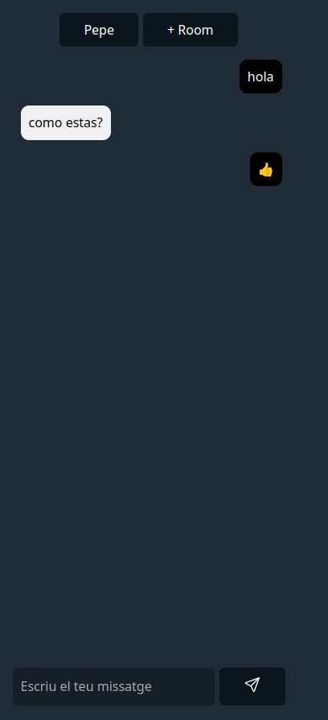

# Chat con Express.js, WebSocket y Node.js

Este es un mini proyecto de chat que utiliza Express.js para el servidor web, WebSocket para la comunicación en tiempo real y Node.js como entorno de ejecución. Además, el chat es capaz de interpretar emojis a través de caracteres como ":)" y convertirlos en emojis Unicode.

## Instalación

1. Clona este repositorio en tu máquina local:

```bash
git clone https://github.com/cnievaslozano/xat.git
```

2. Entra en el directorio del proyecto:

```bash
cd xat
```

3. Instala las dependencias:

```bash
npm install
```

# Uso

1. Inicia el servidor:

```bash
nodemon server.js
```

2. Abre tu navegador web y visita http://localhost:3000 para acceder al chat.

3. Puedes usar emojis a través de caracteres como ":)" y ":thumbsup:" en tus mensajes. Se convertirán automáticamente en emojis Unicode.

```js
const shortcodeMap = {
        ':)': '😊',
        ':(': '😞',
        ':D': '😃',
        ':O': '😲',
        ';)': '😉',
        ':P': '😛',
        ':|': '😐',
        ':*': '😘',
        '<3': '❤️',
        // etc ..
    };
```


## Tecnologías Utilizadas
- Express.js: Framework web para Node.js.
- WebSocket: Implementación de WebSocket para Node.js.
- Node.js: Entorno de ejecución de JavaScript del lado del servidor.
- Nodemon: Herramienta que reinicia automáticamente el servidor cuando se realizan cambios en los archivos.
- Water.css: Un framework CSS mínimo y ligero para comenzar rápidamente sin afectar el estilo predeterminado del navegador.

## Contribución
¡Las contribuciones son bienvenidas! Si deseas mejorar este proyecto, no dudes en enviar un pull request.
 